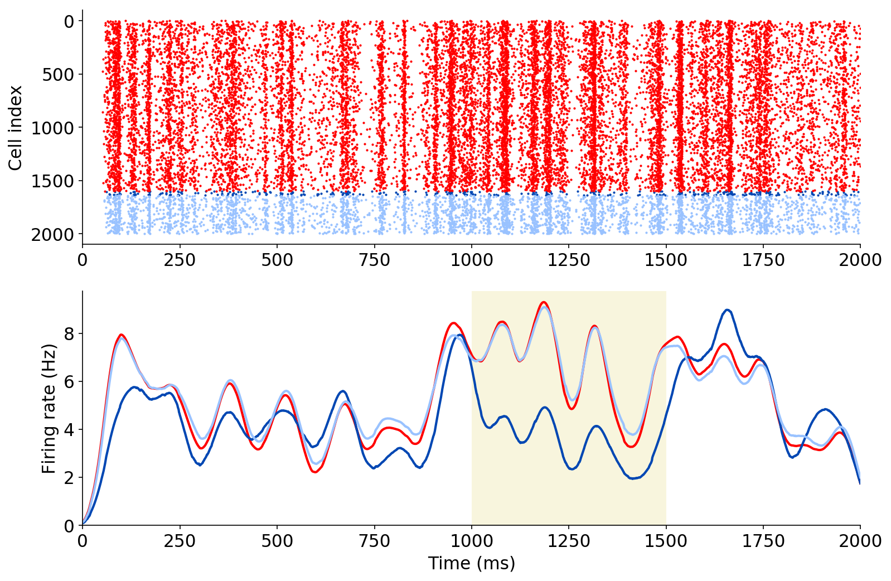

### PyNN Model

This version of the network can run in PyNN using simulator NEST

To simulate activity (2000 cells total, with 0.75 of the inhibitory cells perturbed), and then plot result:

```
python runNetwork.py nest .75 2000
python analysis_perturbation_pynn.py .75 2000
```


To simulate activity (2000 cells total, with 0.1 of the inhibitory cells perturbed), and then plot result:

```
python runNetwork.py nest .1 2000
python analysis_perturbation_pynn.py .1 2000
```




