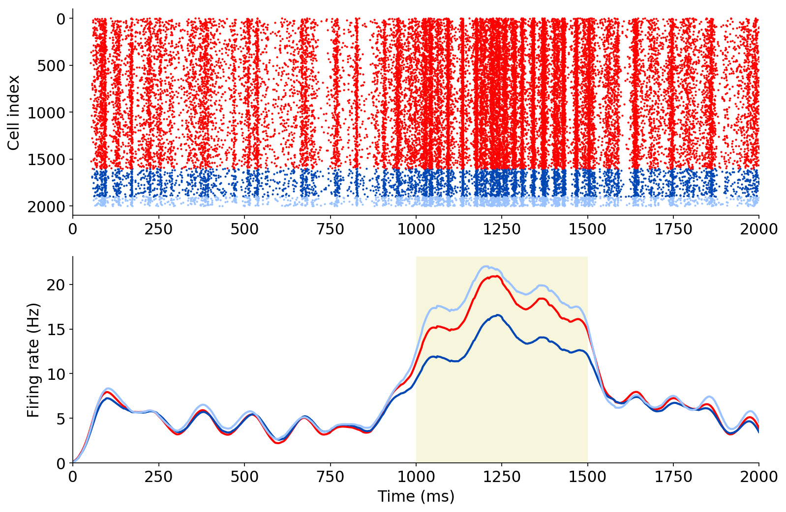

### PyNN Model

This version of the network can run in PyNN using simulator NEST

To simulate activity (with 0.75 of the inhibitory cells perturbed), and then plot result:

```
python runNetwork.py nest .75
python analysis_perturbation_pynn.py .75
```



To simulate activity (with 0.1 of the inhibitory cells perturbed), and then plot result:

```
python runNetwork.py nest .1
python analysis_perturbation_pynn.py .1
```


