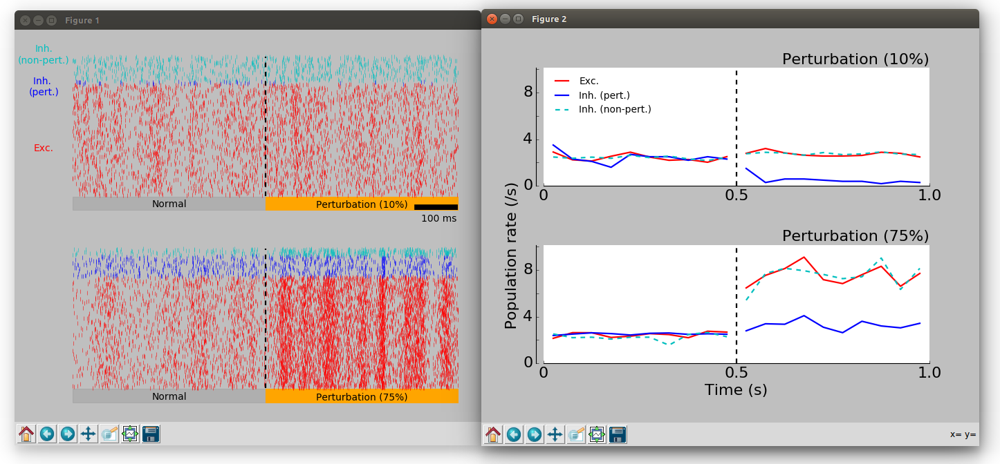
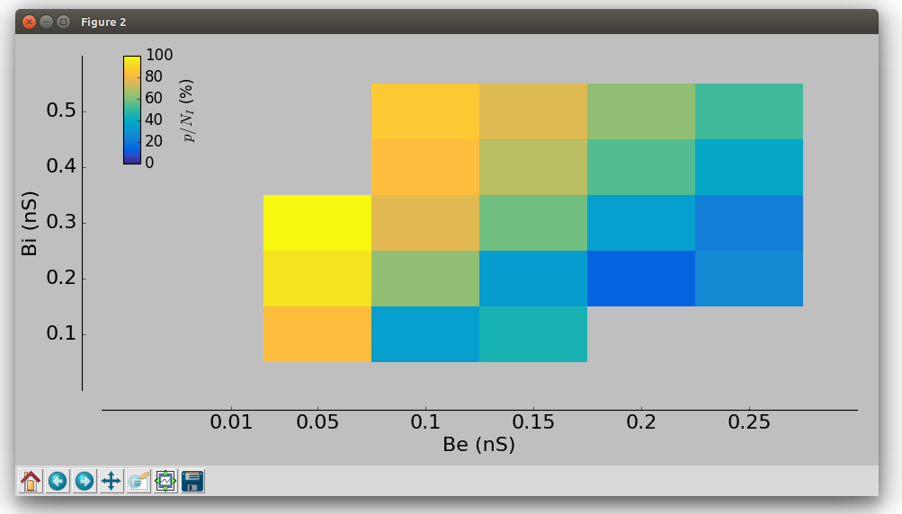
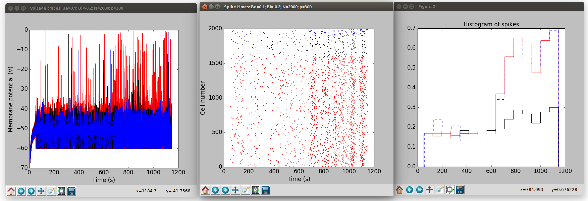

### Spiking Simulation Models

To run:

```
python simulateNetworks.py
```
This will take 1-4 hours (change n_cores in defaultParams.py). After this run try:

```
python figureSample.py
```
to show results of representative simulation (see Figure 10 A & B in Sadeh et al 2017):



and then

```
python analyzeResults.py
python figureAllSims.py
```
to analyse network properties across multiple values of excitation/inhibition (Figure 10 C & D)



#### Test the network

A single run of the network can be tested with:

```
cd test
python testNetwork.py
```
